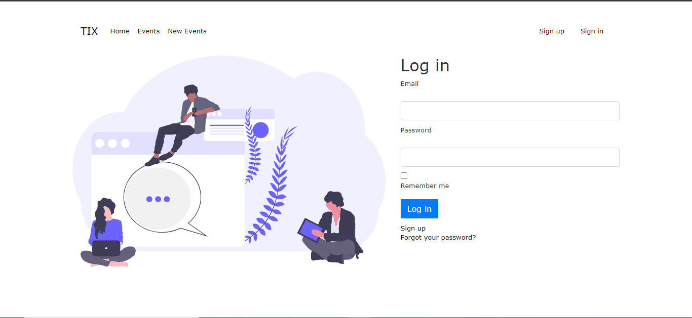
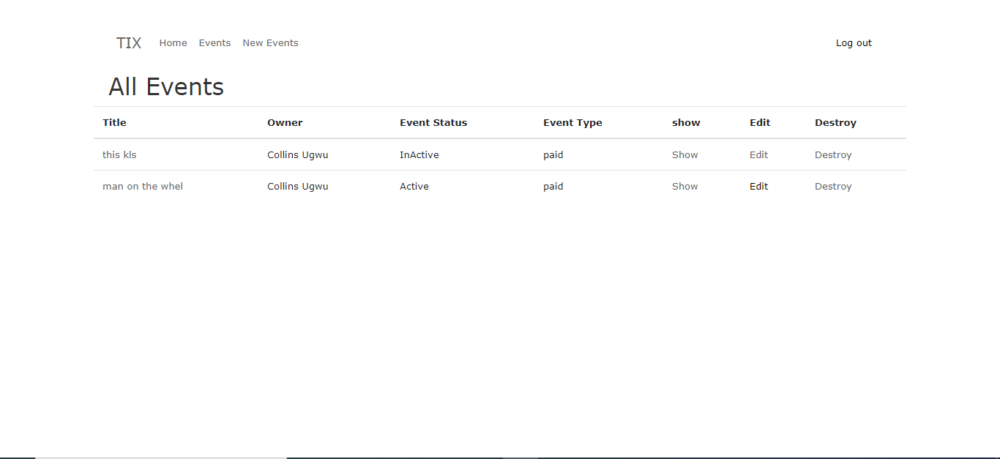

<!-- PROJECT SHIELDS -->
<!--
*** I'm using markdown "reference style" links for readability.
*** Reference links are enclosed in brackets [ ] instead of parentheses ( ).
*** See the bottom of this document for the declaration of the reference variables
*** for contributors-url, forks-url, etc. This is an optional, concise syntax you may use.
*** https://www.markdownguide.org/basic-syntax/#reference-style-links
-->
[![Contributors][contributors-shield]][contributors-url]
[![Forks][forks-shield]][forks-url]
[![Stargazers][stars-shield]][stars-url]
[![Issues][issues-shield]][issues-url]
[![MIT License][license-shield]][license-url]


<!-- PROJECT LOGO -->
<br />
<p align="center">
  <h3 align="center">Tix Test</h3>
  <p align="center">Link to life Version of the <a href="#">app</a></p>
  <p align="center">
    A basic MVP of a ticketing application, using only traditional CRUD methods.
    <br />
    <a href="https://github.com/collinsugwu/tix.africa-test/blob/master/README.md"><strong>Explore the docs �</strong></a>
    <br />
    <br />
    <a href="https://www.theodinproject.com/courses/ruby-programming/lessons/advanced-building-blocks.">Assigment</a>
    �
    <a href="https://github.com/collinsugwu/tix.africa-test/issues">Report Bug</a>
    �
    <a href="https://github.com/collinsugwu/tix.africa-test/issues">Request Feature</a>
  </p>
</p>


<!-- TABLE OF CONTENTS -->
## Table of Contents

* [About the Project](#about-the-project)
  * [Built With](#built-with)
* [Getting Started](#getting-started)
  * [Prerequisites](#prerequisites)
  * [Installation](#installation)
* [Usage](#usage)
* [Roadmap](#roadmap)
* [Contributing](#contributing)
* [License](#license)
* [Contact](#contact)
* [Acknowledgements](#acknowledgements)


<!-- ABOUT THE PROJECT -->
## About The Project
<p>Sign In View</p>


<p>News Feeds View</p>

<!-- [![Product Name Screen Shot][product-screenshot]](https://example.com) -->

I  Our (DIY) event ticketing platform — Tix.africa — allows users to create an event and go live (selling paid or free tickets) in under five minutes. Using Ruby on Rails (or equivalent MVC framework), build a basic MVP of a ticketing application, using only traditional CRUD methods.

### Built With
This progam was made using this technologies
* [Ruby](https://www.ruby-lang.org/en/)
* [Rails](https://rubyonrails.org/)
* [Rspec](https://github.com/rspec/rspec)
* [PostgreSQL](https://www.postgresql.org/)
* [Rubocop](https://github.com/rubocop-hq/rubocop)
* [Stickler](https://stickler-ci.com/)
* [Device-gem](https://github.com/heartcombo/devise)
* [Friendly-Id](https://github.com/norman/friendly_id)

<!-- GETTING STARTED -->
## Getting Started

To get a local copy up and running follow these simple example steps.

### Prerequisites

* Ruby
You can easily install Ruby on your Linux computer by using [Homebrew](https://docs.brew.sh/) and [Chruby](https://github.com/postmodern/chruby)
```sh
brew install chruby
brew install ruby-install
ruby-install ruby
```

* Rails
  You can easily install Rails by using [the odin project's giude](https://www.theodinproject.com/courses/web-development-101/lessons/your-facebook-clonelication) or directly from the [rails site](https://rubyonrails.org/)

```sh
  gem install rails
```

### Installation

<!-- 1. Get a free API Key at [https://example.com](https://example.com) -->
1. Clone the repo
```sh
git clone https://github.com/collinsugwu/tix.africa-test
```
 3. Install pg in your rails app
```sh
gem install pg
``` 
<!-- 4. Enter your API in `config.js`
```JS
const API_KEY = 'ENTER YOUR API';
``` -->
4. Testing, Run this command
```
rspec
```

<!-- USAGE EXAMPLES -->
## Usage
1. Sign up with devise gem
2. create a user
3. create, update, edit and delete an event
4. see active and inactive events


<!-- LIVE VERSION -->
## Live link
[tix-africa]()
<!-- ROADMAP -->
## Roadmap

See the [open issues](https://github.com/collinsugwu/tix.africa-test/issues) for a list of proposed features (and known issues).


<!-- CONTRIBUTING -->
## Contributing

Contributions are what make the open source community such an amazing place to be learn, inspire, and create. Any contributions you make are **greatly appreciated**.

1. Fork the Project
2. Create your Feature Branch (`git checkout -b feature/AmazingFeature`)
3. Commit your Changes (`git commit -m 'Add some AmazingFeature'`)
4. Push to the Branch (`git push origin feature/AmazingFeature`)
5. Open a Pull Request


<!-- LICENSE -->
## License

Distributed under the MIT License. See `LICENSE` for more information.


<!-- CONTACT -->
## Contact


* Collins Ugwu: [Github](https://github.com/collinsugwu), [Twitter](https://twitter.com/collinsugwu_me)

Project Link: [https://github.com/collinsugwu/tix.africa-test](https://github.com/collinsugwu/tix.africa-test)

<!-- ACKNOWLEDGEMENTS -->